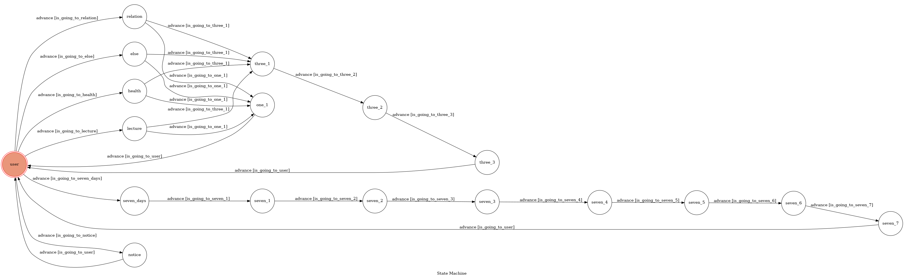
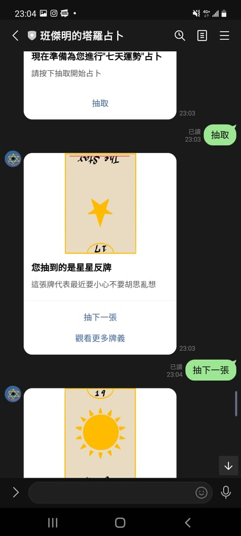
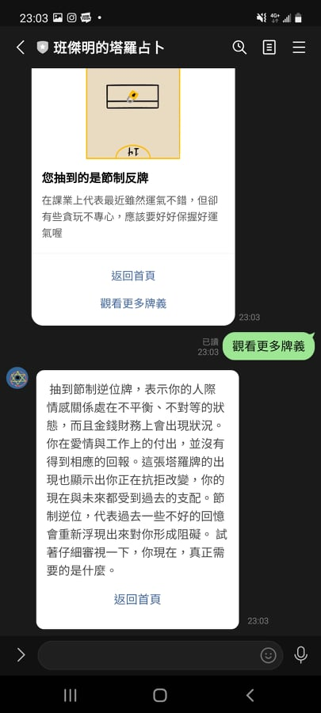
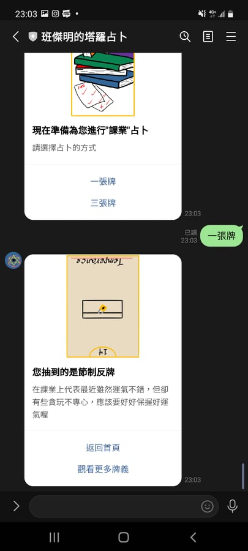
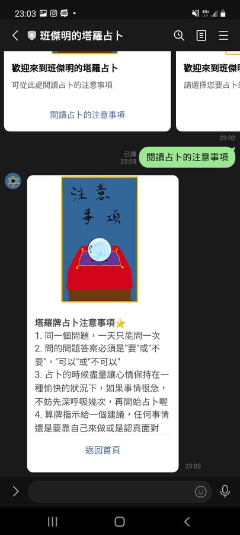
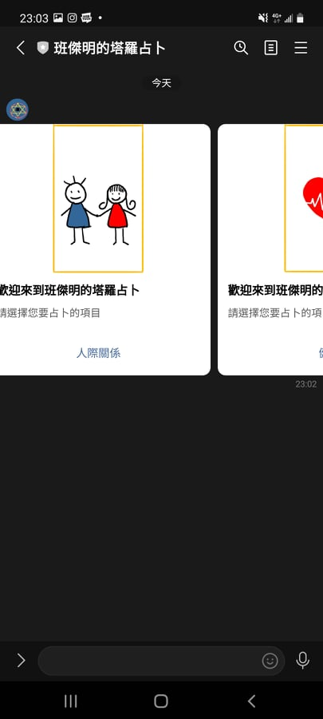
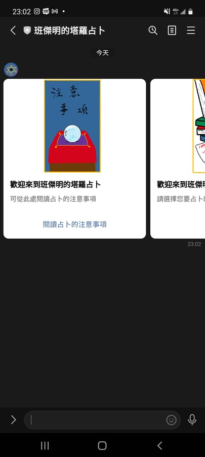

# TOC Project 2021 - Tarot ChatBot

### 功能說明
利用chatbot進行塔羅牌占卜，目前提供學業、人際、健康、七天運勢和其他類五種占卜方向，除了七天運勢外的項目可選擇要使用一張牌(簡易法)和三張牌(標準法)來進行占卜，占卜所使用的牌組為基本22張大秘儀

### 資料取得
五大類占卜結果是從我本身在用的工具書和長年占卜的經驗中得出"較為精簡"的結果，若是使用者想更了解每張牌的內容及含意，亦能點選觀看更多牌義，查看經驗更豐富的占卜師在網路上所分享的結果(利用爬蟲)，另外，占卜過程所使用到的塔羅牌皆是由我手工繪製

### 使用技術
python
linechatbot api
爬蟲

### FSM

### 使用畫面截圖

